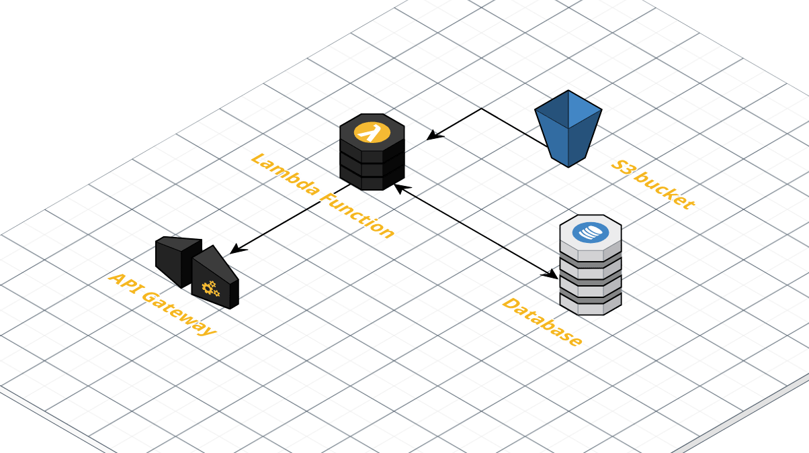

# DP4 Event-Driven Data Ingestion

Set up an event-driven data pipeline using Amazon S3, Lambda, DynamoDB, and the API Gateway. The aims of this solution are:

1. New data arrives in an S3 bucket. This is a JSON file with an expected format.
2. This triggers a Lambda function that ingests the data, deserializes the JSON, and inserts it into a DynamoDB table.
3. Finally, all data is made available via a `GET` request from a public API.

- - -

## Resources

<a target="_new" href="https://us-east-1.console.aws.amazon.com/cloudformation/home?region=us-east-1#/stacks/quickcreate?stackName=ds3022-dp4&templateURL=https://s3.amazonaws.com/uvasds-systems/ds3022/cloudformation/dp4-launch-template.yaml" target="_new"></a>

[Source Template](dp4-launch-template.yaml)

This assumes that users have an active set of AWS credentials installed locally. **Be sure that your AWS command-line keys correlate to the account you use to sign into the AWS Console.**

GitHub Codespaces can be used for this project, but the AWS CLI and your keys must be installed:

```
$ sudo pip install awscli
```
Then configure the CLI with your keys with this command:
```
$ aws configure
```



This stack creates:

- An S3 bucket for new data files.
- An S3 bucket policy that allows the instructor account to `PUT` new objects in student buckets.
- A DynamoDB table with partition and sort keys.

The bucket and Dynamo table will be joined by a Lambda function that you will author and publish using Chalice. The files in this repository will get you started.
 
## Steps

1. Launch the resource stack using the button above.
2. Fork and clone this repository to your local computer.
3. Create a virtual environment and install dependencies from the `requirements-dev.txt` file.
4. Finish the logic of `app.py` and then use `chalice deploy` to iterate on versions of your code.

You can use the `test-access.py` file to emulate data files arriving in your bucket.

## Cleanup 

Be sure to delete your CloudFormation stack when indicated to by the instructor.